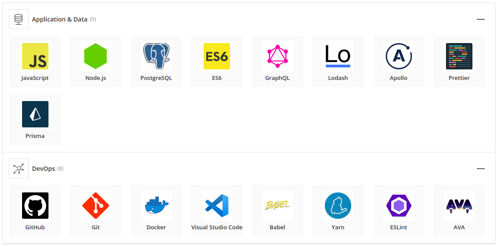

# node-boilerplate

[](https://hitsofcode.com/view/github/cuongw/node-boilerplate)
[](https://stackshare.io/cuongw/node-boilerplate)
[](https://github.com/cuongw/node-boilerplate/blob/master/LICENSE)

> 🌏🚀 A Node.js boilerplate with RESTful, GraphQL, Prisma, PostgreSQL and awesome tools.

## Features

- Using ESNext
- Setup Babel, ESLint, Prettier, Ava and Husky.
- Having Basic authentication and authorization.
- Setup a basic RESTful API.
- Integrating Graphql.
- Using Prisma and PostgreSQL.

## Stack



## Prepare

- [Node](https://nodejs.org/en/)
- [Yarn](https://yarnpkg.com/en/)
- [Docker](https://phoenixnap.com/kb/how-to-install-docker-on-ubuntu-18-04)
- [Docker Compose](https://docs.docker.com/compose/install/)

## How to use?

### Step 1: Clone this project and remove `.git` folder

```sh
$ git clone https://github.com/cuongw/node-boilerplate.git
$ cd node-boilerplate && rm -rf .git
```

### Step 2: Launch Prisma and the connected database

```sh
$ sudo docker-compose up -d
```

### Step 3: Deploy the Prisma datamodel and generate Prisma client

```sh
$ yarn prisma:deploy
```

### Step 4: Install dependencies and run the project

```sh
$ yarn
$ yarn start:dev
```

🙌 Awesome

## Contributors

[](https://sourcerer.io/fame/cuongw/cuongw/node-boilerplate/links/0)[](https://sourcerer.io/fame/cuongw/cuongw/node-boilerplate/links/1)[](https://sourcerer.io/fame/cuongw/cuongw/node-boilerplate/links/2)[](https://sourcerer.io/fame/cuongw/cuongw/node-boilerplate/links/3)[](https://sourcerer.io/fame/cuongw/cuongw/node-boilerplate/links/4)[](https://sourcerer.io/fame/cuongw/cuongw/node-boilerplate/links/5)[](https://sourcerer.io/fame/cuongw/cuongw/node-boilerplate/links/6)[](https://sourcerer.io/fame/cuongw/cuongw/node-boilerplate/links/7)

## License

MIT © [cuongw](https://github.com/cuongw)
